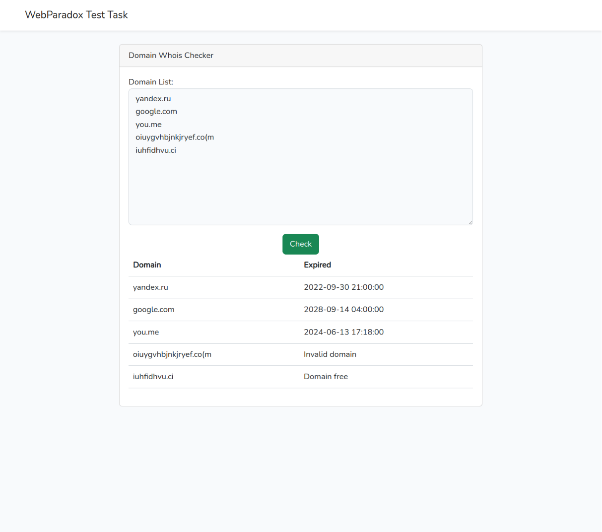

# Тестовое задание WebParadox на позицию "PHP Программист"
## Описание
> на вход отдаем список доменов (простая форма с textarea)  
выводим на той же странице(spa) таблицу с доменами -  проверку по whois - асинхронно(то есть каждый домен отдельный поток) - vuejs/livewire  
https://packagist.org/?query=whois для проверки доменов  
дата окончании регистрации или если домен свободен - пишем свободен
проверяем домены на уникальность и валидность  
делаем git репозиторий на github/bitbucket и даем линк  
задача не более чем на 4 часа, никаких баз, авторизаций и украшательств

## Технологии
 
- PHP 8.0
- Laravel 9
- Livewire

## Результат

## Замечания
1. На контент файла [paradox.js](resources/js/paradox.js) внимания не обращать. Это функции из [туториала](https://programmingwithswift.com/run-async-await-in-parallel-with-javascript/#:~:text=In%20order%20to%20run%20multiple,(see%20Conclusion%20for%20caveat).).
Я забыл его очистить перед загрузкой кода в github. Извините.
2. Код асинхронных запросов был добвлен прямо в [whois.blade.php](resources/views/livewire/whois.blade.php), потому что
команда `npm run build`(сборщик Vite) игнорировала контент файлов `resources/js.*.js` при сборке. Вот соответствующее [issue](https://github.com/vitejs/vite/issues/6913) на их трекере.
Быстро понять, как это исправить я не смог. Ваш HR сказала мне, что можно js-код сделать inline`ом в любом шаблоне.  

## Автор

© 2022 Кудрявцев Максим Александрович - [Резюме](https://disk.yandex.ru/i/MAZp3GW56X4qfA)
